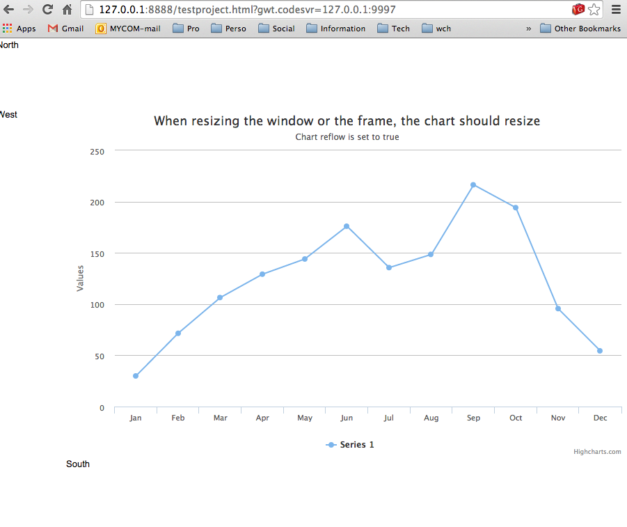

highcharts4gwt
=============

 

## Status
v0 still in development.

I re-wrote the way I generated the classes. Thanks to that I am able to support inheritances betweens options.

It starts to look good on the "static" side. 

Plus I created a new project "highcharts" were I put all the chart options. It is cleaner so that the chart options are not mixed with the generator code. You can use that project to test the api in your gwt project. 

See the project readme for more info on how to use it.

First rendering of a chart achieved by using the generated API !!!

Lot of work to do but a big first step accomplished :)

Here is the result inside the test project application: 

What the code looks like : 

	ChartOptions options = (ChartOptions) JavaScriptObject.createObject();

	options.subtitle().text("Chart reflow is set to true");
	options.title().text("Chart reflow is set to true");

	Series series = (Series) JavaScriptObject.createObject();

	ArrayNumber data = series.data();
	data.push(29.9);
	data.push(71.5);
	data.push(106.4);
	data.push(129.2);
	data.push(144.0);
	data.push(176.0);
	data.push(135.6);
	data.push(148.5);
	data.push(216.4);
	data.push(194.1);
	data.push(95.6);
	data.push(54.4);

	options.series().addToEnd(series);

	ArrayString categories = options.xAxis().categories();
	categories.push("Jan");
	categories.push("Feb");
	categories.push("Mar");
	categories.push("Apr");
	categories.push("May");
	categories.push("Jun");
	categories.push("Jul");
	categories.push("Aug");
	categories.push("Sep");
	categories.push("Oct");
	categories.push("Nov");
	categories.push("Dec");

	container.renderChart(options);

If you want to test simply run highcharts4gwt as a Java application it will generate the API code.

## Description
The goal of this project is to create an "auto-generated" GWT highcharts wrapper.

To know more about Highcharts please have a look to [the official web page](http://www.highcharts.com/products/highcharts)

This project has been created as an alternative to the very good [Moxiegroup](http://www.moxiegroup.com/) highcharts wrapper [http://www.moxiegroup.com/moxieapps/gwt-highcharts/](http://www.moxiegroup.com/moxieapps/gwt-highcharts/), sources of that project can be found on [sourceforge](http://sourceforge.net/projects/gwt-highcharts/) 

#Why this wrapper ?

* Moxie wrapper does not seem to be maintained anymore (last commit on August 2013)
* I disagree with some of the design choices in moxie wrapper (mix between view and model that prevent an easy mvp implementation and testing)
* I would like to have a wrapper that can be generated automatically from highcharts [options dump](http://api.highcharts.com/highcharts/option/dump.json) to keep up to date easily with api changes

To know more about this project please go to the [project website](https://gwthighcharts.github.io/)

#What should the generated code look like ?

* Fluent api
* As close as possible to the Javascript syntax
* As much as possible @JsInterface and @JsProperty ready [blog post](http://ronanquillevere.github.io/2014/02/02/GWT-futur-javascript-interop.html#.U_7f6zK1Z5I)
* Model (Options etc...) separated from Widget (The panel displaying the chart in GWT)
* Junit testable
  * Being able to use DI to choose between real JSO or Mock for tests.
